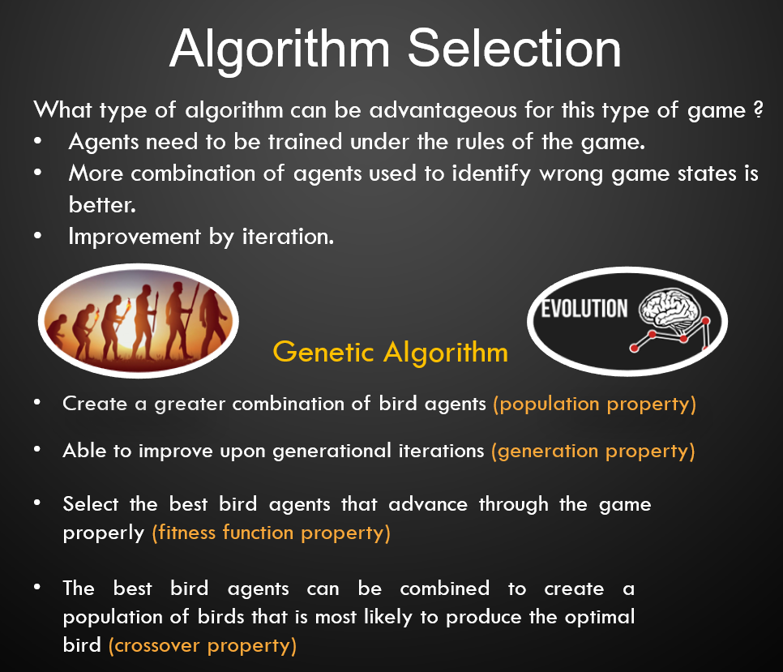
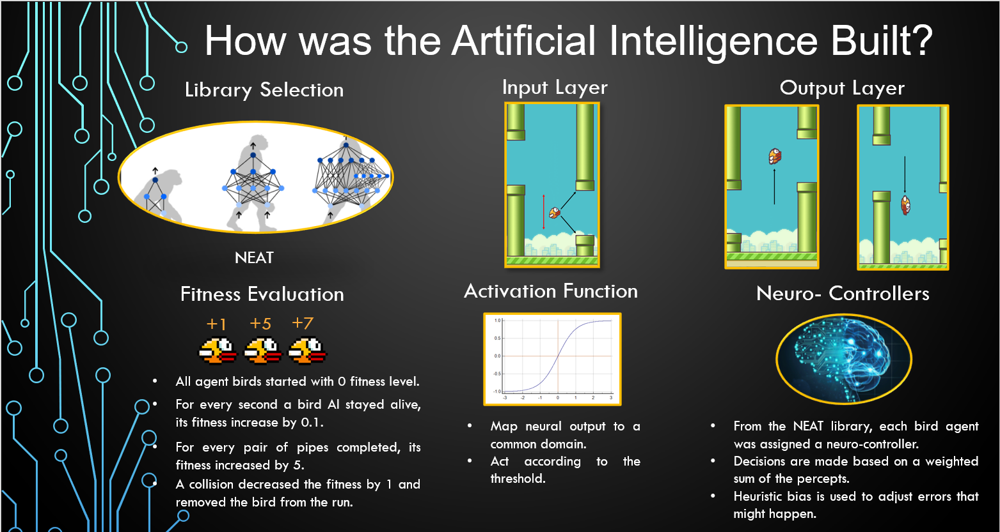

# Flappy Bird AI

## Project

The game of flappy bird consists of a bird that
navigates through a pair of pipes. In the game, the score of
a match is determined by the number of pipe pairs that a bird
manages to pass through without causing a collision with the
pipes. This project is aimed at the exploration of an artificial
intelligence for the game by employing the library of neuro
evolution of augmenting topologies for the realization of a genetic
algorithm that produces a bird AI capable of achieving a score
of 200 points.

### Genetic Algorithm



### Building Process



```
Requirements to run the program:
Python 3.x
pygame
neat-Python
```

```
How install the requirements ?
- Download Python 3.x from python.org
On your terminal or anaconda's cmd:
- run the command "pip install pygame" to get the pygame modules
- run the command "pip install neat-python" to get the neat modules
```

**NOTE** : Test the installation of the modules by using commands "pip show pygame" and "pip show neat-python"
if the installation was successful you should see the version as well as other information of the modules.
If not, make sure to try the installation process again.

```
Make sure before running the program that you have the following files in the same directory:
- game.py
- configFB.txt
- animations folder
```

**NOTE** : If any of the files is missing, the program will not run correctly.

## How to run the program:

```
1) Recommended IDE: spyder from anaconda explorer.
- Go to the top task bar of spyder IDE.
- Click green run button.
- Check the console window at the bottom right to interact with the program.
- If you are using this option make sure that the installations of pygame and neat are made in anaconda's cmd.

2)Optional (Terminal):
You can run the command "python game.py" and the program will start.
```

## How to use the program?

- Once you run the program, a pygame window will pop which will be the game with the preset AI. No further action is required.

## How to run other configurations?

- To see how the AI can fly infinitely simply go to the configFB.txt file.
- Under NEAT, you can change pop_size parameter to a higher number( greater than 100 recommended) to see how the population
  size affects the outcome of the algorithm.
- You can also test how a lower population number affects the performance as well (the number needs to be strictly greater than 1)

## How does the program terminate?

- The program will terminate once the maximum number of allowed generations are produced (50 generations) and no
  optimal agent is obtained.
- The program can also terminate once the bird agent achieves a score of 200 points, since that was the goal state
  defined for the project.
- Lastly, you can simply click the "X" button in the top right of the pygame window to manually terminate the program.
